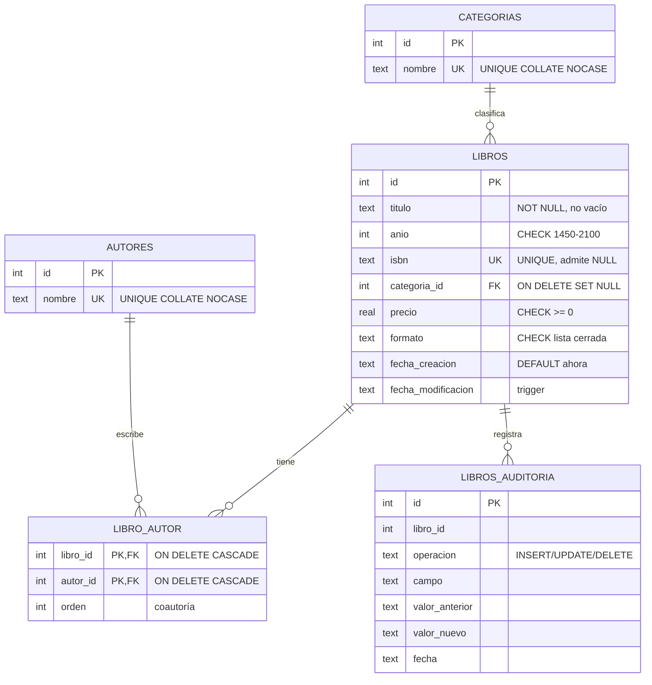

# Sistema de Gestión de Libros Electrónicos

Aplicación en Go sobre SQLite para administrar un catálogo de libros
electrónicos. Se usa desde la consola o desde el navegador.

Además del CRUD implementa un modelo relacional normalizado con restricciones
de integridad, claves foráneas, índices, una vista, disparadores de auditoría,
transacciones y migraciones versionadas.

O compilando un binario:

```bash
go build -o gestor-libros .
./gestor-libros
./gestor-libros -web
```

El programa abre `libros.db` con ruta relativa, así que debe ejecutarse desde
el directorio del proyecto. Desde otra carpeta crearía una base nueva y vacía.

La primera vez crea el archivo con todo el esquema:

```
Aplicando migración 1: esquema relacional (autores, categorías, N:M, auditoría)...
Migración 1 aplicada.
```

### Menú de consola

```
  1) Agregar libro
  2) Listar catálogo
  3) Buscar libros (ID, título o autor)
  4) Actualizar libro
  5) Eliminar libro
  6) Reportes y estadísticas
  7) Historial de cambios (auditoría)
  8) Salir
```

### Interfaz web

Ofrece lo mismo que el menú, sin inicio de sesión.

| Pantalla | Ruta | Opción equivalente |
|---|---|---|
| Catálogo y buscador | `/` | 2 y 3 |
| Ficha del libro | `/libro/{id}` | 3 |
| Alta | `/libro/nuevo` | 1 |
| Edición | `/libro/{id}/editar` | 4 |
| Baja | botón de la fila | 5 |
| Reportes y plan de ejecución | `/reportes` | 6 |
| Historial de cambios | `/auditoria` | 7 |

No duplica la lógica: reutiliza las mismas funciones y consultas SQL que la
consola. Al no haber autenticación está pensada para uso local.

## Estructura del repositorio

```
.
├── main.go       Modelo, esquema, CRUD, reportes y menú de consola
├── web.go        Rutas HTTP y plantillas del modo -web
├── web/
│   ├── estatico/app.css     Hoja de estilos
│   └── plantillas/*.html    base, catalogo, detalle, formulario,
│                            reportes, auditoria
├── go.mod
├── go.sum
├── .gitignore
└── README.md
```

`web/` se incrusta en el ejecutable con `go:embed`, así que `go build` produce
un solo archivo. `libros.db` no se versiona: se genera al ejecutar el programa.

## Modelo de datos



### Tablas

| Tabla | Propósito |
|---|---|
| `libros` | Entidad principal del catálogo |
| `autores` | Cada autor existe una sola vez |
| `categorias` | Cada categoría existe una sola vez |
| `libro_autor` | Tabla puente N:M entre libros y autores |
| `libros_auditoria` | Bitácora de cambios, llenada por la base de datos |

### Restricciones de integridad

Viven en el esquema, no en el código Go: cualquier herramienta que abra la base
queda sujeta a ellas.

| Columna | Restricción | Impide |
|---|---|---|
| `libros.titulo` | `NOT NULL` + `length(trim(titulo)) > 0` | Títulos vacíos |
| `libros.anio` | `CHECK (anio BETWEEN 1450 AND 2100)` | Años imposibles |
| `libros.isbn` | `UNIQUE` | ISBN duplicados |
| `libros.precio` | `CHECK (precio >= 0)` | Precios negativos |
| `libros.formato` | `CHECK (formato IN (...))` | Formatos inventados |
| `libros.categoria_id` | `FOREIGN KEY ... ON DELETE SET NULL` | Categorías inexistentes |
| `libro_autor` | `PRIMARY KEY (libro_id, autor_id)` | Repetir el mismo autor en un libro |
| `libro_autor` | `FOREIGN KEY ... ON DELETE CASCADE` | Vínculos huérfanos |
| `autores.nombre` | `UNIQUE COLLATE NOCASE` | "Rothfuss" y "ROTHFUSS" como autores distintos |

Un libro sin ISBN o sin formato guarda `NULL`, no cadena vacía: en SQLite un
`NULL` nunca es igual a otro, así que `UNIQUE` sigue admitiendo varios libros
sin ISBN.

### Índices

| Índice | Columna | Para qué |
|---|---|---|
| `idx_libros_categoria` | `libros.categoria_id` | Agrupar y filtrar por categoría |
| `idx_libros_titulo` | `libros.titulo` | Ordenar y buscar por prefijo |
| `idx_libros_anio` | `libros.anio` | Filtrar por año |
| `idx_libro_autor_autor` | `libro_autor.autor_id` | Ir del autor a sus libros |
| `idx_auditoria_libro` | `libros_auditoria.libro_id` | Historial de un libro |

`libro_autor.libro_id` no se indexa porque la clave primaria compuesta ya sirve
de índice para ese lado. El reporte de plan de ejecución corre
`EXPLAIN QUERY PLAN` para comprobar cuáles se aprovechan.

### Vista

`v_catalogo` deja escrito una sola vez el `LEFT JOIN` de cuatro tablas y usa
`group_concat` para reunir los coautores en un solo campo. El listado y las
búsquedas la consultan como si fuera una tabla.

### Disparadores

| Trigger | Cuándo | Qué hace |
|---|---|---|
| `tr_libros_insert` | `AFTER INSERT` | Registra el alta |
| `tr_libros_delete` | `AFTER DELETE` | Registra la baja, también en borrados por `CASCADE` |
| `tr_libros_update_*` | `AFTER UPDATE OF <campo>` | Uno por campo: guarda valor anterior y nuevo |
| `tr_libros_fecha_mod` | `AFTER UPDATE` | Sella `fecha_modificacion` |

Los de modificación usan `WHEN old.campo IS NOT new.campo` para no registrar
cambios falsos. Se usa `IS NOT` y no `<>` porque `NULL <> NULL` no da verdadero.

La aplicación nunca escribe en `libros_auditoria`, de modo que la bitácora
registra también los cambios hechos desde fuera del programa.

## Funcionalidades

### CRUD

- Agregar: admite varios autores separados por coma. Autores y categorías se
  crean solos si no existen. Todo ocurre dentro de una transacción.
- Listar: catálogo completo desde la vista.
- Actualizar: en consola, dejar un campo vacío conserva el valor actual; en la
  web el formulario llega con los valores cargados.
- Eliminar: los vínculos de `libro_autor` se borran por `CASCADE`. Los autores
  y la categoría permanecen, porque pueden pertenecer a otros libros.

### Búsquedas

| Modo | Técnica SQL |
|---|---|
| Por ID | `WHERE id = ?` |
| Por título | `LIKE` sobre la vista |
| Por autor | `JOIN` con la tabla puente + `DISTINCT` |
| Por título o autor | `OR` con subconsulta `IN` |

Ignoran mayúsculas y tildes mediante `sin_acentos()`, una función escrita en Go
y registrada dentro de SQLite. Sin ella, buscar `garcia` no encontraría a
`García Márquez`, porque el `LIKE` de SQLite solo ignora mayúsculas en ASCII.
Los comodines `%` y `_` que escriba el usuario se escapan con `ESCAPE '\'`.

### Reportes

| Reporte | Cláusulas SQL |
|---|---|
| Resumen general | `COUNT`, `SUM`, `AVG`, `MIN`, `MAX`, subconsultas escalares |
| Libros por categoría | `LEFT JOIN` + `GROUP BY` + `ROUND` |
| Autores más publicados | `JOIN` + `GROUP BY` + `HAVING` + `LIMIT` |
| Libros por formato | `GROUP BY` sobre columna con `NULL` |
| Los 5 más caros | `ORDER BY ... DESC` + `LIMIT` |
| Plan de ejecución | `EXPLAIN QUERY PLAN` |

## Decisiones técnicas

Migraciones versionadas. La última migración aplicada se guarda en el propio
`.db` con `PRAGMA user_version`. Al arrancar se aplican solo las pendientes,
cada una en su propia transacción. La inicial reconstruye una base antigua sin
perder datos: SQLite no permite añadir un `CHECK` o una `FOREIGN KEY` a una
columna existente, así que renombra la tabla, crea la nueva, copia los datos y
borra la vieja. Para un cambio futuro basta con agregar una entrada a la lista
`migraciones`.

PRAGMA en la cadena de conexión.

```go
dsn := ruta + "?_pragma=foreign_keys(1)&_pragma=busy_timeout(5000)"
```

SQLite trae las claves foráneas desactivadas por defecto y los `PRAGMA` valen
por conexión. Como `database/sql` mantiene un pool, un `db.Exec("PRAGMA
foreign_keys=ON")` configuraría una sola conexión. En el DSN el driver los
aplica a todas.

Consultas parametrizadas. Todas usan marcadores `?`; ningún dato del usuario se
concatena al SQL.

Errores traducidos. El mensaje crudo del driver se convierte en algo legible,
por ejemplo `ya existe otro libro con ese ISBN (la columna es UNIQUE)`. Quien
rechaza sigue siendo la base de datos.

## Inspeccionar la base a mano

```bash
sqlite3 libros.db

.tables                              -- tablas y vistas
.schema libros                       -- definición con restricciones
PRAGMA user_version;                 -- versión de esquema aplicada
PRAGMA foreign_key_check;            -- vacío = sin referencias huérfanas
SELECT * FROM v_catalogo;            -- catálogo con el JOIN resuelto
SELECT * FROM libros_auditoria;      -- bitácora de cambios
```

## Limitaciones conocidas

- La ruta de `libros.db` es relativa al directorio de ejecución.
- Las búsquedas con patrón `%texto%` recorren la tabla completa: un comodín
  inicial inutiliza cualquier índice. Con un catálogo grande convendría FTS5.
- No hay pantalla para renombrar o fusionar autores y categorías; solo se crean
  al dar de alta un libro.
- El orden de los coautores en el listado no está garantizado por
  `group_concat`. La ficha de detalle sí respeta la columna `orden`.
- La interfaz web no tiene autenticación y escucha en todas las interfaces del
  equipo, así que no conviene exponerla fuera de una red de confianza.
